# FinBoard

A customizable financial dashboard that lets users create and manage financial widgets powered by **Finnhub** and **Alpha Vantage** APIs, to explore price history, quotes, and technical views quickly.

---

## 🏗️ Tech Stack

* **Framework**: React 18 + Vite
* **Styling**: Tailwind CSS + shadcn/ui
* **State Management**: Zustand (localStorage persistence)
* **Charts**: Recharts
* **Routing**: React Router DOM
* **Client Cache**: IndexedDB via `localforage`

---

## 🏗️ Architecture

```mermaid
flowchart TD
  U[User Browser] -->|UI Interaction| R[React + Vite App]

  subgraph Frontend [Frontend App]
    R --> Z[Zustand Store]
    R --> C[shadcn/ui Components + Recharts]
  end

  subgraph ClientStorage [Client-Side Storage]
    LS[localStorage\nDashboard Config]
    IDB[IndexedDB via localforage\nAPI Response Cache]
  end

  subgraph API_Providers [External APIs]
    A[Alpha Vantage API]
    F[Finnhub API]
  end

  %% Cache-first flow for API data
  R -->|Check Cache / Fetch| IDB
  IDB -->|Cache Hit| R
  IDB -->|Cache Miss → Fetch| A
  IDB -->|Cache Miss → Fetch| F

  %% Config persistence
  Z -->|Persist Config| LS
  LS -->|Restore State| Z
```


> **Refresh semantics**
>
> * **Page reload** → fetches **fresh** data (financial data should not be stale).
> * **Duplicate widgets** (same inputs) → **served from cache** to save quota.
> * **Refresh button** in a widget → **bypasses cache** and forces a new API call.

---
## DEMO : 
1) **App Demo** : [<i>Video</i>](https://drive.google.com/file/d/1_Vj_kblnhBlKqqF8fN9XuioP3CtvoFby/view?usp=sharing)
2) **Cache Demo** : [<i>Video</i>](https://drive.google.com/file/d/1jd0fLd1g7WlacfWc4FUiZOXn63LX3Qnj/view?usp=sharing)
---
## Project Structure

```
src/
├── components/
│   ├── layout/           # Header, Footer, Hero
│   ├── modals/           # Widget creation/edit dialogs
│   ├── ui/               # shadcn/ui wrappers
│   └── widgets/          # Financial widget components
├── lib/                  # API clients, cache, utils
├── pages/                # Route components
├── store/                # Zustand stores
└── hooks/                # Custom hooks
```

---

## ✨ Features

* **Multi-Provider**: Finnhub + Alpha Vantage
* **Widgetized**: Add/remove per symbol & interval
* **Charts**: Line, candlestick (OHLCV), volume overlays
* **Client Caching**: IndexedDB (TTL per interval)
* **Persistent Layout**: Zustand + localStorage
* **Responsive UI**: Tailwind + shadcn/ui

---

## Installation

```bash
# Local
git clone <YOUR_GIT_URL>
cd finboard
npm install
npm run dev        # http://localhost:5173

# Production
npm run build
npm run preview
```

---

## 📦 API Setup & Dashboards

<details>
  <summary><strong>API Keys & Limits</strong></summary>

### Finnhub (free tier)

* 60 calls/min
* 1000 calls/day
  Get a key: [https://finnhub.io/register](https://finnhub.io/register)

### Alpha Vantage (free tier)

* 5 calls/min
* 500 calls/day
  Get a key: [https://www.alphavantage.co/support/#api-key](https://www.alphavantage.co/support/#api-key)

> **Demo endpoints** (Alpha Vantage `apikey=demo`) are free to use home page for exploration of widgets -> NO API KEY REQUIRED FOR THEM !.

</details>

<details>

### `/` — HOME PAGE

* Free widgets creation without need of API KEY - internally using Alpha Vantage's free API endpoints for 'IBM' and 'MSFT' companies..

### `/dashboard` — Finnhub

* Real-time quote widgets (current price, change, %)
* Manual **Refresh** button (bypasses cache)

### `/dashboard2` — Alpha Vantage

* Historical time series (Daily/Weekly/Monthly/Intraday)
* **OHLCV candlestick** + volume
* Interval aware TTL caching (e.g., intraday shorter, daily longer)

</details>

---

## 🛠️ API Endpoints (collapsible)

<details>
  <summary><strong>Finnhub</strong> (examples)</summary>

```http
# Real-time Quote
GET https://finnhub.io/api/v1/quote?symbol=AAPL&token=YOUR_API_KEY

# Company Profile
GET https://finnhub.io/api/v1/stock/profile2?symbol=AAPL&token=YOUR_API_KEY

# Candles (Historical)
GET https://finnhub.io/api/v1/stock/candle?symbol=AAPL&resolution=D&from=1672531200&to=1672617600&token=YOUR_API_KEY
```

**Quote response**

```json
{
  "c": 261.74, "h": 263.31, "l": 260.68, "o": 261.07,
  "pc": 259.45, "t": 1582641000
}
```

</details>

<details>
  <summary><strong>Alpha Vantage</strong> (examples)</summary>

```http
# Daily
GET https://www.alphavantage.co/query?function=TIME_SERIES_DAILY&symbol=IBM&apikey=YOUR_API_KEY

# Weekly
GET https://www.alphavantage.co/query?function=TIME_SERIES_WEEKLY&symbol=MSFT&apikey=YOUR_API_KEY

# Monthly
GET https://www.alphavantage.co/query?function=TIME_SERIES_MONTHLY&symbol=AAPL&apikey=YOUR_API_KEY

# Intraday (5min)
GET https://www.alphavantage.co/query?function=TIME_SERIES_INTRADAY&symbol=GOOGL&interval=5min&apikey=YOUR_API_KEY

# Demo (rate-limited)
GET https://www.alphavantage.co/query?function=TIME_SERIES_DAILY&symbol=IBM&apikey=demo
```

**Daily response (simplified)**

```json
{
  "Meta Data": {
    "1. Information": "Daily Prices (open, high, low, close) and Volumes",
    "2. Symbol": "IBM",
    "3. Last Refreshed": "2025-09-02",
    "4. Output Size": "Compact",
    "5. Time Zone": "US/Eastern"
  },
  "Time Series (Daily)": {
    "2025-09-02": {
      "1. open": "240.9000",
      "2. high": "241.5500",
      "3. low": "238.2500",
      "4. close": "241.5000",
      "5. volume": "3469501"
    }
  }
}
```

</details>

---

## 🧩 Product Notes (refresh, caching, UX)

* **Reloading page** → **fresh** API calls (<b>priority</b> : financial correctness > stale cache).
* **Duplicate widgets (same inputs)** → **served from cache** to save quota.
* **Refresh button** → **forces** network fetch (bypasses cache).
* **Rate limit UX** → show **“Quota exceeded”** widget state with a **retry countdown**.

---

## 🧠 Caching Policy (client-side)

* Backend-less caching via **IndexedDB** (`localforage`)
* **TTL by interval** (can be tuned as needed): currently set to 300s showing priority given to fresher data in fast-change environments such as stock's

---

## 🚧 Development

```bash
npm run dev          # Start dev server
npm run build        # Build for production
```

### Adding New Providers

1. Add provider client in `src/lib/` (fetch + parse + normalize).
2. Add provider store in `src/store/`.
3. Create widgets in `src/components/widgets/`.
4. Wire route under `src/pages/` and navigation.

---

## 🔮 Future Enhancements

* [ ] WebSockets for real-time updates (dependent on API providers..(
* [ ] Drag-and-drop widgets + Import/Export widgets : Product Scope
* [ ] Multi API Provider's Support
---
